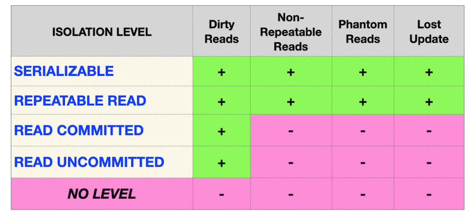

## Day 08 - PostgreSQL_Pool

_Isolation is one of ACID properties_

Database Theory has 4 foundametal data anomalies (physical anomalies).
- Lost Update Anomaly
- Dirty Reads Anomaly
- Non-repeatable Reads Anomaly
- Phantom Read Anomaly

Therefore there are different Isolation Levels in ANSI SQL standard that prevent famous anomalies.

From one side this matrix should be a Standard for every Relational Database, but reality ... looks a bit different.

|  |  | |
| ------ | ------ | ------ |
| PostgreSQL |  |
| Oracle |  |
| MySQL |  |

Nowadays, IT community found a set of new anomalies based on Database Model (logical view)
- Read Skew Anomaly
- Write Skew Anomaly
- Serialization Anomaly
- Fan Traps Anomaly
- Chasm Traps Anomaly 
- Data Model Loops Anomaly
- etc.

### Exercise 00 - Simple transaction

Please for this task use the command line for PostgreSQL database (psql). You need to check how your changes will be published in the database for other database users. 

Actually, we need two active sessions (meaning 2 parallel sessions in the command lines). 

Please provide a proof that your parallel session can’t see your changes until you will make a `COMMIT`;

Take a look at the steps below.

**Session #1**
- update of rating for “Pizza Hut” to 5 points in a transaction mode .
- check that you can see a changes in session #1

**Session #2**
- check that you can’t see a changes in session #2

**Session #1**
- publish your changes for all parallel sessions.

**Session #2**
- check that you can see a changes in session #2

You can see the same query returns different results, because the first one was run before publishing in Session#1 and the second one was queried after finished Session#1. 

### Exercise 01 - Lost Update Anomaly

Please for this task use the command line for PostgreSQL database (psql). You need to check how your changes will be published in the database for other database users. 

Actually, we need two active sessions (meaning 2 parallel sessions in the command lines). 

Before a task, make sure you are at a default isolation level in your database. Just run the next statement

`SHOW TRANSACTION ISOLATION LEVEL;`

and the result should be “read committed”;

If not, then please set “read committed” isolation level explicitly on a session level.

|  |  |
| ------ | ------ |
| Let’s check one of the famous “Lost Update Anomaly” database pattern. You can see a graphical presentation of that anomaly on a picture. Horizontal Red Line means the final results after all sequential steps for both Sessions. |  |

Please check a rating for “Pizza Hut” in a transaction mode for both Sessions and after that make `UPDATE` of rating to 4 value in session #1 and make `UPDATE` of rating to 3.6 value in session #2 (in the same order as in the picture). 

### Exercise 02 - Lost Update for Repeatable Read

Please for this task use the command line for PostgreSQL database (psql). You need to check how your changes will be published in the database for other database users. 

Actually, we need two active sessions (meaning 2 parallel sessions in the command lines).

|  |  |
| ------ | ------ |
| Let’s check one of the famous “Lost Update Anomaly” database pattern but under `REPEATABLE READ` isolation level. You can see a graphical presentation of that anomaly on a picture. Horizontal Red Line means the final results after all sequential steps for both Sessions. |  |

Please check a rating for “Pizza Hut” in a transaction mode for both Sessions and after that make `UPDATE` of rating to 4 value in session #1 and make `UPDATE` of rating to 3.6 value in session #2 (in the same order as in the picture). 

### Exercise 03 - Non-Repeatable Reads Anomaly

Please for this task use the command line for PostgreSQL database (psql). You need to check how your changes will be published in the database for other database users. 

Actually, we need two active sessions (meaning 2 parallel sessions in the command lines). 

|  |  |
| ------ | ------ |
| Let’s check one of the famous “Non-Repeatable Reads” database pattern but under `READ COMMITTED` isolation level. You can see a graphical presentation of that anomaly on a picture. Horizontal Red Line means the final results after all sequential steps for both Sessions. |  |

Please check a rating for “Pizza Hut” in a transaction mode for session #1 and after that make `UPDATE` of rating to 3.6 value in session #2 (in the same order as in the picture). 

### Exercise 04 - Non-Repeatable Reads for Serialization

Please for this task use the command line for PostgreSQL database (psql). You need to check how your changes will be published in the database for other database users. 

Actually, we need two active sessions (meaning 2 parallel sessions in the command lines).

|  |  |
| ------ | ------ |
| Let’s check one of the famous “Non-Repeatable Reads” database pattern but under `SERIALIZABLE` isolation level. You can see a graphical presentation of that anomaly on a picture. Horizontal Red Line means the final results after all sequential steps for both Sessions. |  |

Please check a rating for “Pizza Hut” in a transaction mode for session #1 and after that make `UPDATE` of rating to 3.0 value in session #2 (in the same order as in the picture). 

### Exercise 05 - Phantom Reads Anomaly

Please for this task use the command line for PostgreSQL database (psql). You need to check how your changes will be published in the database for other database users. 

Actually, we need two active sessions (meaning 2 parallel sessions in the command lines).

|  |  |
| ------ | ------ |
| Let’s check one of the famous “Phantom Reads” database pattern but under `READ COMMITTED` isolation level. You can see a graphical presentation of that anomaly on a picture. Horizontal Red Line means the final results after all sequential steps for both Sessions. |  |

Please summarize all ratings for all pizzerias in a transaction mode for session #1 and after that make `UPDATE` of rating to 1 value for “Pizza Hut” restaurant in session #2 (in the same order as in the picture). 

### Exercise 06 - Phantom Reads for Repeatable Read

Please for this task use the command line for PostgreSQL database (psql). You need to check how your changes will be published in the database for other database users. 

Actually, we need two active sessions (meaning 2 parallel sessions in the command lines).

|  |  |
| ------ | ------ |
| Let’s check one of the famous “Phantom Reads” database pattern but under `REPEATABLE READ` isolation level. You can see a graphical presentation of that anomaly on a picture. Horizontal Red Line means the final results after all sequential steps for both Sessions. |  |

Please summarize all ratings for all pizzerias in a transaction mode for session #1 and after that make `UPDATE` of rating to 5 value for “Pizza Hut” restaurant in session #2 (in the same order as in the picture). 

### Exercise 07 - Deadlock

Please for this task use the command line for PostgreSQL database (psql). You need to check how your changes will be published in the database for other database users. 

Actually, we need two active sessions (meaning 2 parallel sessions in the command lines). 

Let’s reproduce a deadlock situation in our database. 

|  |  |
| ------ | ------ |
| You can see a graphical presentation of the deadlock situation on a picture. Looks like a “christ-lock” between parallel sessions. |  |

Please write any SQL statement with any isolation level (you can use default setting) on the `pizzeria` table to reproduce this deadlock situation.